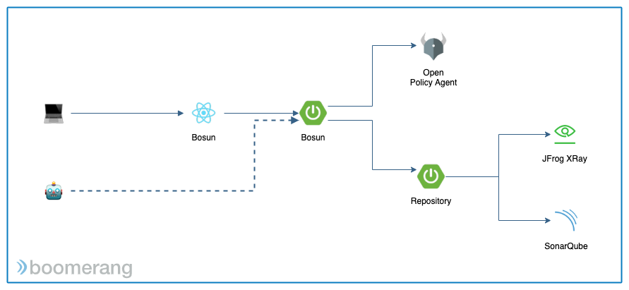

# Bosun

Bosun, by Boomerang, is a policy based gating system that combines [OpenPolicyAgent](https://openpolicyagent.org/) definitions with Rules and Metrics Data to validate if specific Gates are passed.

We currently focus on two use cases:
1. CICD Gates
2. Generic Metric Validation

We also have pre built integrations to retrieve metrics with
- SonarQube
- JFrog X-Ray

All packaged up in containers and easily installed with a helm chart.

## Getting Started

To quickly get started with Bosun, install into a kubernetes cluster of 1.13+ via Helm using the following commands

```
helm repo add boomerang-charts https://xyz
helm install --namespace <namespace> boomerang-charts/bmrg-bosun
```

## Architecture



## Data Model


Bosun utilizes three types of data

1. Policy Definition - The definition written in rego for Open Policy Agent
2. Policy Rules - Rules applicable to the definition
3. Metrics - the data to be validated

(1) and (2) get combined together into a Policy which the Metrics is then validated against.

## APIs
