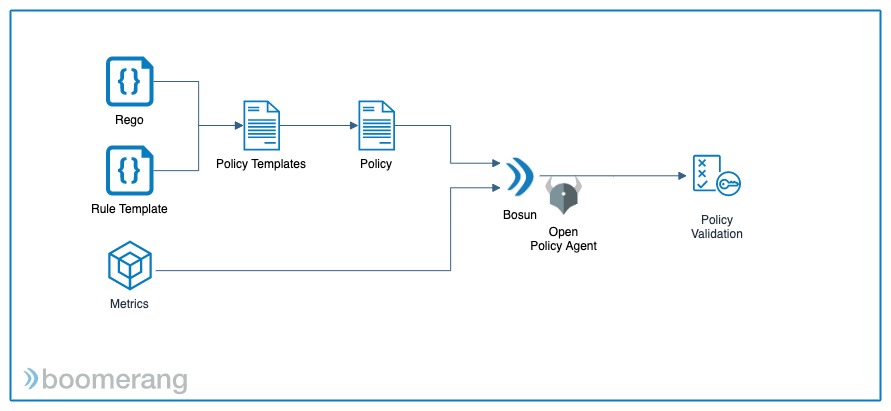

# Bosun

Bosun, by Boomerang, is a policy-based gating system that combines [Open Policy Agent (OPA)](https://openpolicyagent.org/) definitions with Rules and Metrics Data to validate if specific Gates are passed.

We currently focus on two use cases:
1. CICD Gates
2. Generic Metric Validation

We also have pre-built integrations to retrieve metrics with
- SonarQube
- JFrog X-Ray

All packaged up in containers and easily installed with a [Helm](https://helm.sh/) chart.

## Concepts

There are a number of concepts to understand when using Bosun and they will be mentioned in detail throughout the documentation. Here are a few of the important ones:

**Policy Definitions**

the definition written in rego for OPA

**Policy Rules**

rules, in a domain specific lanauge, applicable to the definition

**Metrics**

the data to be validated

**Labels** 

serve two purposes - as metadata that can be stored and displayed with a validation activitiy to help easily identify the related entity, and also as a way to pass in required information to the validation system.

## Getting Started

To quickly get started with Bosun, install into a kubernetes cluster of 1.13+ via Helm using the following commands

```
helm repo add boomerang-charts https://xyz
helm install --namespace <namespace> boomerang-charts/bmrg-bosun
```

## Architecture


## Data Model



Policy Definitions and Rules get combined together into a Policy which the Metrics is then validated against.

## Integrations

Bosun can be used in two ways, generically or pre-integrated with repositories of quality data. When validating generically the Metrics Data is a part of the body of the payload going to Bosun. When validating via pre-integrated data repositories you use labels to pass in any required information.

## APIs

TODO
